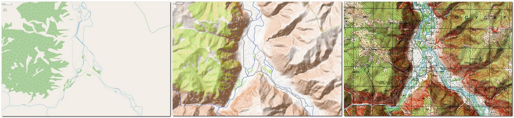
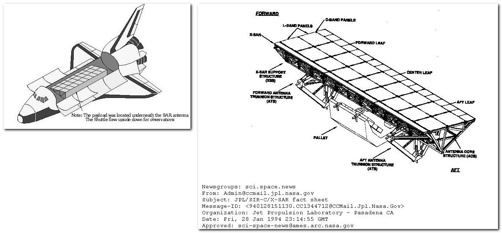

# Цифровые карты и рельеф

Традиционно рельеф принято обозначать на карте кольцами изолиний и затенением на юго-восточном склоне холмов \(в идеале используются оба варианта одновременно\). Но в базе OSM ничего нет про холмы и рельеф. За исключением особых случаев \(обрывы, овраги, точки горных вершин, точки перевалов\), гор и холмов в картографической базе нет. Поэтому если рисовать только то, что есть в базе, карта выглядит абсолютно плоской. На равнине это не критично, а вот в горах, конечно, катастрофа, потому что такая карта создаёт совершенно неправильное представление о местности. Рельеф — очень важная составляющая карты.

_Один и тот же участок горной местности на картах: картостиль_ [_**Carto**_](https://nakarte.me/#m=13/51.18031/87.79269&l=O) _\(данные OSM, высот нет\), картостиль_ [_**OpenTopo**_](https://nakarte.me/#m=13/51.18031/87.79269&l=Otm) _\(данные OSM, высоты визуализированы по данным SRTM\) и нарисованная вручную_ [_**топографическая карта Генштаба**_](https://nakarte.me/#m=13/51.18031/87.79269&l=T)_\*\*\*\*_

Картостили, которые умеют отображать на карте рельеф, берут информацию о рельефе не из базы OSM. Рельеф на средне- и крупномасштабных картах в настоящее время в большинстве случаев отображается с помощью базы данных данных высот SRTM или ASTER GDEM. Разрешение этих данных \(безе SRTM 90 м/пиксель, база ASTER GDEM 30 м/пиксель\) позволяет, при должной обработке, показывать особенности рельефа примерно до 15 зума. В силу меньшей зашумлённости, данные SRTM дают более адекватное представление о рельефе, однако севернее 60° с.ш. и южнее 54° ю.ш. данные SRTM отсутствуют, что вынуждает в конечном итоге использовать оба набора данных при визуализации рельефа на территориях, выходящих за границы покрытия SRTM.

SRTM и ASTER DEM — это названия двух [**экспериментов по измерению формы земного рельефа с орбиты**](http://www.racurs.ru/wiki/index.php/%D0%93%D0%BB%D0%BE%D0%B1%D0%B0%D0%BB%D1%8C%D0%BD%D1%8B%D0%B5_%D1%86%D0%B8%D1%84%D1%80%D0%BE%D0%B2%D1%8B%D0%B5_%D0%BC%D0%BE%D0%B4%D0%B5%D0%BB%D0%B8_%D0%B2%D1%8B%D1%81%D0%BE%D1%82). Такие эксперименты проводились неоднократно и разными странами, но только результаты тех, в которых принимала участие NASA попали в открытый доступ, распространяются без ограничений и активно используются некоммерческими проектами, типа OpenStreetMap. Это связано с законами США, по которым все результаты невоенных проектов государственных агентств \(одним из которых является NASA\) получают статус Public Domain \(народное достояние\) и должны в полном объёме предоставляться общественности.

\*\*\*\*[**SRTM**](https://ru.wikipedia.org/wiki/Shuttle_Radar_Topography_Mission) \(Shuttle Radar Topography Mission\) — это проект NASA. В 2000 г. с борта Space Shuttle “Индевор” была проведена радарная интерферометрическая съемка поверхности земного шара. Съемка охватила почти всю территорию Земли между 60° с.ш. и 56° ю.ш. По результатам съемки была создана цифровая модель рельефа почти 80% поверхности Земли. Данные SRTM существуют в нескольких версиях: предварительной \(SRTM1, 2003 г.\) и окончательной \(SRTM2, 2005 г.\). Окончательная версия прошла дополнительную обработку, выделение береговых линий и водных объектов, фильтрацию ошибочных значений.

_Проект SRTM, размещение локатора SAR в грузовом отсеке летающего вверх ногами шаттла_

Более поздний проект 2010 года [**ASTER GDEM**](https://sovzond.ru/products/spatial-data/digital-models/aster-gdem/) \(Global Digital Elevation Model\) разработан совместно METI \(Ministry of Economy, Trade, and Industry of Japan\) и NASA, и выполнен на основе данных сенсора ASTER картографического спутника Terra. Сенсор осуществлял стереоскопическую съемку вдоль полосы пролета с помощью двух телескопов, снимающих в надир и назад в ближнем инфракрасном диапазоне с c разрешением 15 м. Для создания цифровой базы высот ASTER GDEM была выполнена автоматическая компьютерная обработка всего отснятого массива фотографий, 1,5 млн стереопар. Полученный массив данных о высотах охватывает территорию Земли между 83° с.ш. и 83° ю.ш. \(99% поверхности земного шара\). В 2011 г. была создана улучшенная версия базы высот— ASTER GDEM 2: заполнены пропуски, исправлены ошибки измерения. Для заполнения некорректно отснятых участков использовались результаты более ранних проектов SRTM, CDED \(Canada digital elevation data\) и Alyaska DEM.

К сожалению, картостиль Carto рельеф не отображает никак. Это один из главных его недостатков.

