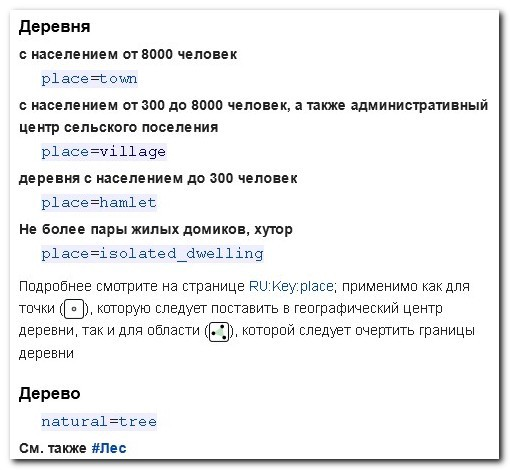

# Карта OSM как база объектов

## Геометрия

Все объекты на карте делятся на четыре типа: Точка, Линия, Полигон и Составной объект.

Объект Точка — это точка. Пара координат “широта-долгота”, указанных с точностью до нескольких сантиметров. Обычно такая точность избыточна, но при необходимости можно обозначить координаты объектов с очень высокой точностью.

Объект Линия — это ломанная линия. Состоит из последовательности точек \(больше того, каждая составляющая линию точка — это самостоятельный объект типа “точка”\). Имеет направление, которое можно при необходимости изменить на обратное. Направленность линии актуальна не для всех объектов, но в ряде случаев это важно, например, если мы рисуем реку \(течение\), улицу с односторонним движением или контур обрыва \([**принято, что пропасть находится справа от рисуемой линии**](https://wiki.openstreetmap.org/wiki/RU:Tag:natural=earth_bank#.D0.9A.D0.B0.D0.BA_.D0.BE.D0.B1.D0.BE.D0.B7.D0.BD.D0.B0.D1.87.D0.B0.D1.82.D1.8C_.D0.BD.D0.B0_.D0.BA.D0.B0.D1.80.D1.82.D0.B5)\).

Объект Полигон — это замкнутый многоугольник. По сути, это просто замкнутая ломанная линия, но тут идеологическое отличие. Линия — это линия. А многоугольник — это площадь. Поэтому линиями обозначаются протяжённые объекты \(реки, дороги, границы, заборы\), а полигонами — объекты, имеющие площадь \(здания, огороженные территории, озёра, участки леса\). В некоторых случаях, впрочем, можно обозначить полигон и как линейный объект, так, например, полигон, обозначающий территорию парковки можно обозначить сразу и как парковку и как забор. Описание “парковка” будет распространяться на территорию внутри полигона, а описание “забор” — на его периметр.

Четвертый тип объекта — Составной \(в терминологии OSM этот тип объектов называется “Отношение”/”Relation”\). Сам по себе такой объект не содержит ни одной точки и ни одной линии. Но в его состав можно включать другие объекты.

Например, автобусный маршрут можно составить из всех участков улиц, по которым он проходит \(одна и та же улица может быть включена в несколько разных маршрутов, если они все по этой улице проходят\).

Более сложный пример: территории с дырками внутри. Например, у нас есть лес, внутри леса есть поляна. Поляна внутри леса, но она не часть леса. Чтобы нарисовать такой лес, мы сначала рисуем Полигон-границу леса \(важно, что сам по себе мы этот внешний Полигон никак не атрибутируем, он имеет смысл только как часть Составного объекта\). Затем рисуем полигон-поляну внутри этого леса. Затем создаём составной объект и назначаем ему внешний Полигон в качестве внешней границы \(“outer”\), а внутренний Полигон в качестве внутренней границы \(“inner”\). Если после этого мы при помощи атрибутов опишем этот составной объект как “лес” — на карте получится лес с дыркой внутри.

Объединение и пересечение линий. Когда мы рисуем линию на карте, добавляя к ней новые точки, если мы очередную точку поставим близко к другой линии, новая линия приклеивается к существующей, и обе линии получают общую точку — пересечение. Так создаются перекрёстки.

Перекрёстки — это на самом деле очень важно. Потому что существующие алгоритмы построения маршрутов по картам OSM активно используют информацию о нанесённых на карту дорогах и перекрёстках для прокладки по ним маршрута \(в соответствии с выбранными ограничениями, например, автомобильный маршрут не прокладывается по лестницам и тропинкам, а пешеходный маршрут — да\).

В общем случае, пересекающимся линиям вовсе не обязательно иметь общую точку. Таким образом создаются, например, мосты и тоннели, где дороги пересекаются на разных уровнях и не имеют перекрёстка. Кроме того, две пересекающиеся линии вообще могут описывать объекты разных типов, например, шоссе и пересекающую его высоковольтную линию. Нет никакого смысла делать у этих линий общую точку.

С геометрией, в принципе, всё. Теперь с обозначениями объектов.

## Тэги

Все четыре вышеперечисленные вида геометрических фигур могут иметь атрибуты \(тэги\), перечень строк вида “атрибут=значение”. Этих пар “атрибут-значение” у любого объекта может быть сколько угодно \(хотя обычно не больше пяти\), и именно их сочетание определяет, что за объект обозначен этой фигурой на карте. Так, например, если мы нарисуем Полигон и добавим ему атрибут building=yes, он станет зданием. А если дополнительно добавим атрибут shop=supermarket, он станет не просто зданием, а зданием супермаркета.

Если геометрический объект не имеет никаких атрибутов и не входит ни в один составной объект, то он ничего не значит и на карте сам по себе никак потом не отрисовывается. Таковыми “пустыми” объектами являются, к примеру, большинство Точек нарисованного забора. Сам-то забор является геометрической фигурой типа Линия с атрибутом “забор”, а вот входящие в него объекты-Точки только придают ему форму и ничего не обозначают. Но могут и обозначать. Например, вы можете выбрать нужную Точку забора и добавить ей атрибут “ворота=да”. Эта Точка тут же станет точкой въезда и будет обозначаться на карте значком “ворота”.

По большому счёту, все атрибуты объектов делятся на три категории: определяющие \(определяют общий тип объекта: например, дорога это, река или забор\), уточняющие \(уточняют подвид объекта: переулок или шоссе\) и не обязательные \(например, название улицы, номер дома или тип дорожного покрытия\). Какие-то атрибуты обязаны иметь значением конкретный вариант из ограниченного списка \(например атрибут, описывающий материал дорожного покрытия\), какие-то атрибуты могут иметь произвольное значение \(например, названия улиц\), значения некоторых атрибутов обязательно должны быть заданы в виде числа \(например, количество этажей здания\). Есть уточняющие атрибуты вида “мост=да” или “тоннель=да”, они поясняют, что этот отрезок дороги/ручья проходит по мосту/в тоннеле/в трубе.

Вот и вся премудрость.

Очень важно понять, что это всё. Это и есть вся карта OSM. Она в основе очень просто устроена. Всего четыре типа объектов, каждому из которых можно назначить произвольное количество описывающих их атрибутов.

Но, конечно, OSM это не только геометрические объекты с атрибутами. Это ещё и громадные таблицы, которые перечисляют, какими сочетаниями атрибутов следует обозначать больницы, переулки, церкви, парки, магазины, обрывы, съезды с шоссе, автобусные остановки, тротуары и т.п. Сотни различных объектов, для каждого из которых может быть с десяток необязательных уточняющих атрибутов.

Да, иногда для описания простого, казалось бы, объекта, атрибутов требуется перечислить неожиданно много. Например, церковь обозначается как территория, для которой заданы свойства: Назначение=Объект поклонения, Религия=Христианство, Течение=Православие \(amenity=place\_of\_worship + religion=christian + denomination=russian\_orthodox\).

Но и в этих гигантских таблицах всё сводится всё к тем же “определяющему, уточняющему и дополнительным” атрибутам простой геометрической фигуры.

Всё, абсолютно всё, что вы можете найти на карте, от крупных мегаполисов до глухих пастушьих троп через горы, отрисовано при помощи вот этого простого набора геометрических фигур и их атрибутов. Это и есть карта OSM.

