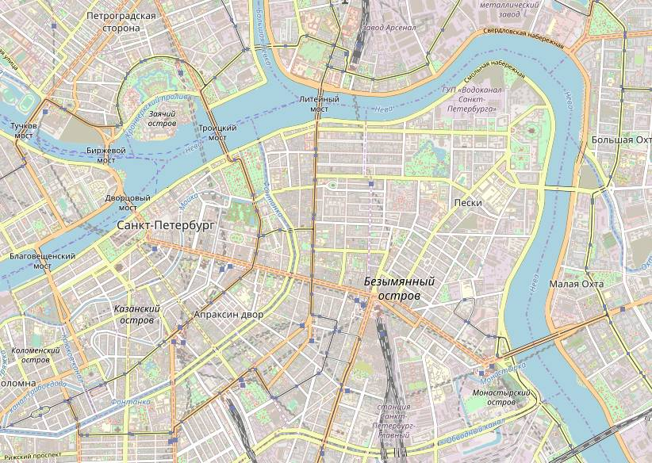
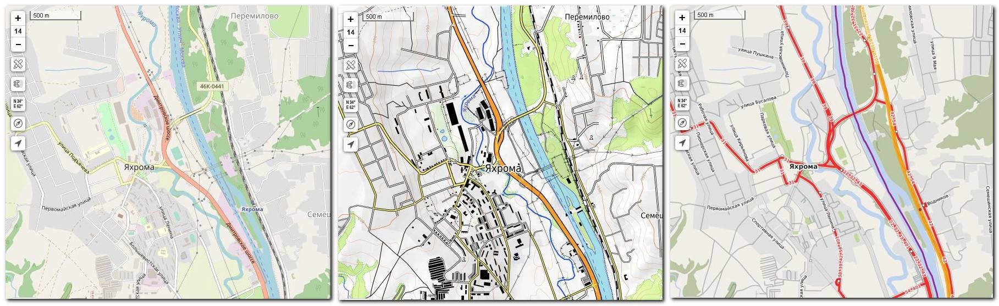

# Картостили

Карта "OpenStreetMap" \(её название обычно сокращают до OSM\) — это единственная карта, к внутреннему устройству которой у нас есть полный доступ. Для всех остальных карт можно получить только готовую картинку с нарисованной картой. Для карты OpenStreetMap эту готовую картинку тоже можно получить, но куда важнее, что можно посмотреть, проанализировать и даже изменить исходную базу данных объектов, на основе которой потом автоматически формируется готовая картинка с картой.

Больше того, алгоритмов, формирующих картинку на основании одной и той же базы объектов существует много \(полезных —меньше\). Они называются “картостилями”. То, что обыватель привык считать, собственно, картой OpenStreetMap.org, на самом деле всего лишь один из картостилей — [**картостиль Carto**](https://wiki.openstreetmap.org/wiki/Standard_tile_layer). И он отображает далеко не все объекты, которые внесены в базу картографических объектов. Существуют сайты, на которых можно увидеть результат работы и других картостилей.

_Один и тот же участок карты OSM, отрисованный картостилями_ [_**Carto**_](https://www.openstreetmap.org/#map=14/56.2842/37.5080)_,_ [_**OpenTopo**_](https://opentopomap.org/#map=14/56.29540/37.49415) _и_ [_**Public Transport**_](http://publictransportmap.org/#37.5029;56.2902;14)_\*\*\*\*_

На самом деле, карта OSM — это не красивая картинка, как большинство привыкло думать. OSM — это база картографических объектов. База первична, картинка \(или, как мы теперь знаем, картинки\) формируются на её основе. Давайте поподробнее разберемся, как эта база устроена, это позволит нам лучше понять возможности, ограничения и способы использования карты OSM.

